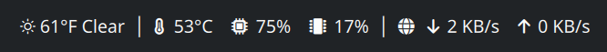

# Weather && Stats

> A KDE Plasma 6 **panel/taskbar widget** displaying live weather and system stats in a single compact bar. Designed to sit in your top or bottom panel — not a desktop widget.

  



---

## Stats

| Stat | Details |
|---|---|
| **Weather** | Current conditions via [Open-Meteo](https://open-meteo.com/) — no API key required |
| **CPU Temp** | Reads from hwmon (Intel coretemp, AMD k10temp/zenpower, ARM cpu-thermal); turns red above your threshold |
| **CPU Usage** | Sampled from `/proc/stat` |
| **Memory** | Percentage of RAM in use |
| **Network** | Live download/upload on your most active interface |

All stats refresh on configurable intervals. Each section can be toggled on or off.

---

## Requirements

| Requirement | Notes |
|---|---|
| KDE Plasma 6.0+ | |
| `bash`, `free`, `/proc/stat`, `/proc/net/dev` | Standard on any Linux system |
| [Nerd Font](https://www.nerdfonts.com/) | Optional — falls back to plain Unicode symbols if disabled in settings |

---

## Installation

```bash
git clone https://github.com/samjage/weather-and-stats.git
kpackagetool6 --type Plasma/Applet --install weather-and-stats
```

Then right-click your panel → **Add Widgets** → search for **Weather && Stats**.

> **Placement:** Plasma always adds new widgets at a default position. After adding, right-click your panel → **Enter Edit Mode** and drag the widget to your preferred spot (e.g. left of the system tray). Plasma has no API for widgets to declare a position automatically.

### Updating

```bash
kpackagetool6 --type Plasma/Applet --upgrade weather-and-stats
```

---

## Configuration

Right-click the widget → **Configure Weather && Stats**

### Weather

| Setting | Description | Default |
|---|---|---|
| Location | City name, geocoded via Open-Meteo | Chicago, IL |
| Temperature unit | °F or °C | °F |
| Show condition text | Adds e.g. "Partly Cloudy" after the temp | Off |
| Weather refresh | How often to fetch weather | 5 min |

### System Stats

| Setting | Description | Default |
|---|---|---|
| CPU temp unit | °F or °C | °C |
| CPU temp threshold | Temp at which the reading turns red | 80°C |
| Stats refresh | How often to poll system stats | 3 sec |
| CPU temp | Toggle visibility | On |
| CPU usage | Toggle visibility | On |
| Memory | Toggle visibility | On |
| Network | Toggle visibility | On |

### Appearance

| Setting | Description | Default |
|---|---|---|
| Nerd Font icons | Disable for plain Unicode symbol fallback | On |

---

## How it works

Weather is fetched via `XMLHttpRequest` — no API key, no account needed. [Open-Meteo](https://open-meteo.com/) is free for non-commercial use.

System stats come from `contents/stats.sh`, a small shell script the widget runs on a timer. It takes two `/proc/stat` samples 1 second apart to calculate CPU usage and reads `/proc/net/dev` for network throughput. No external dependencies beyond standard Linux interfaces.

---

## License

GPL-2.0 — see `metadata.json` for the declaration.
